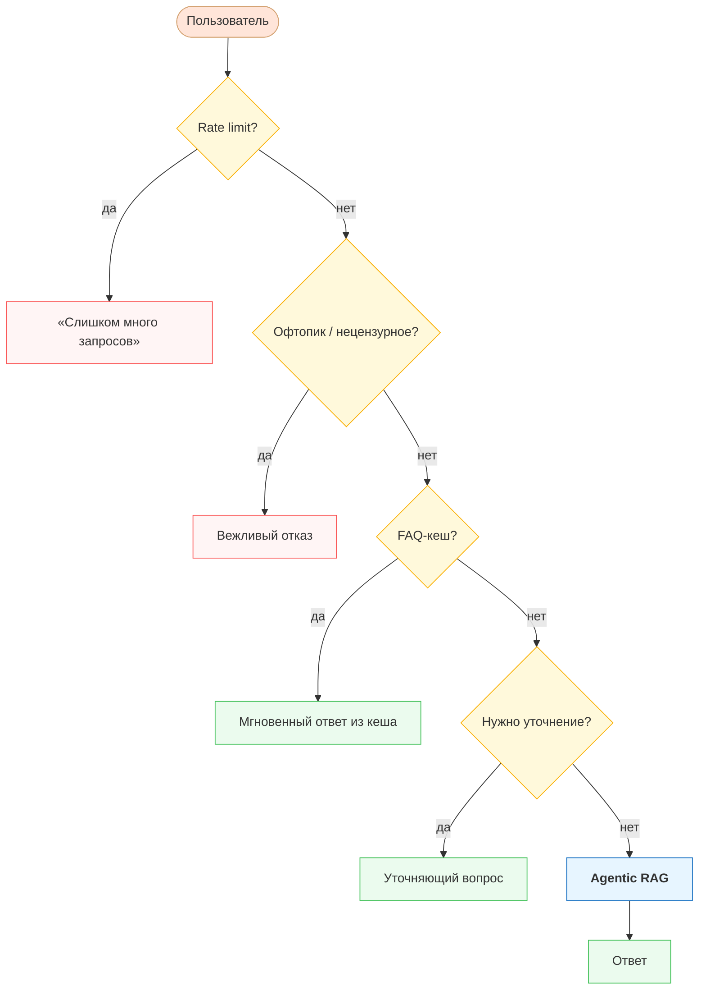
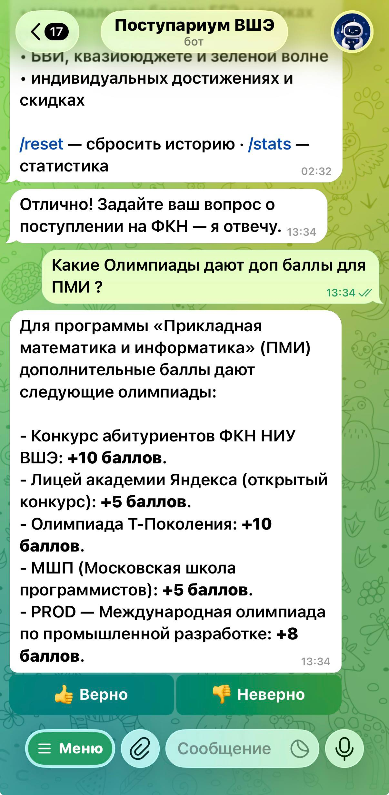
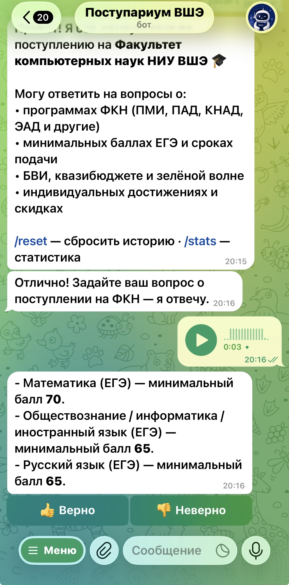
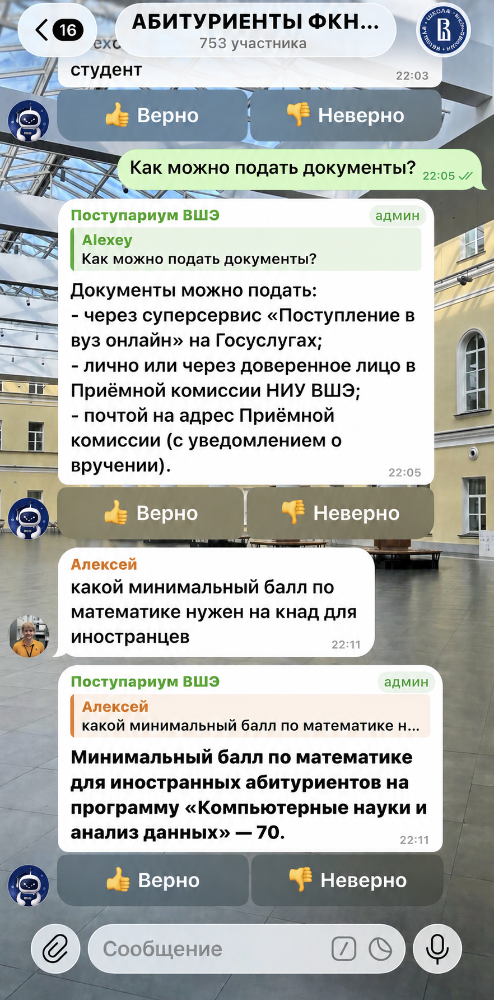
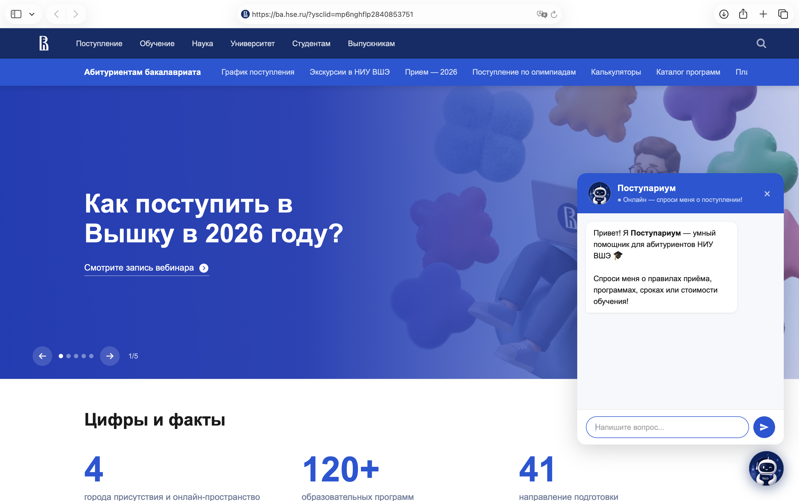
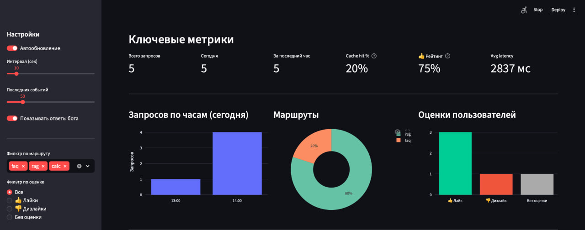
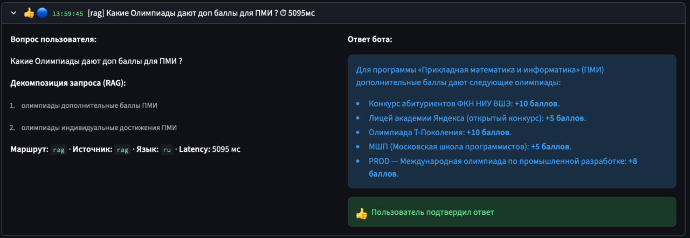
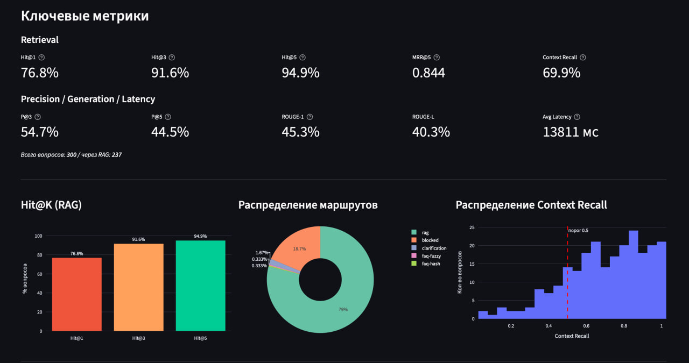
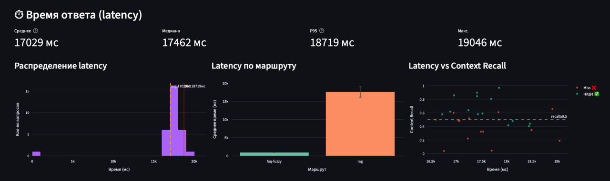
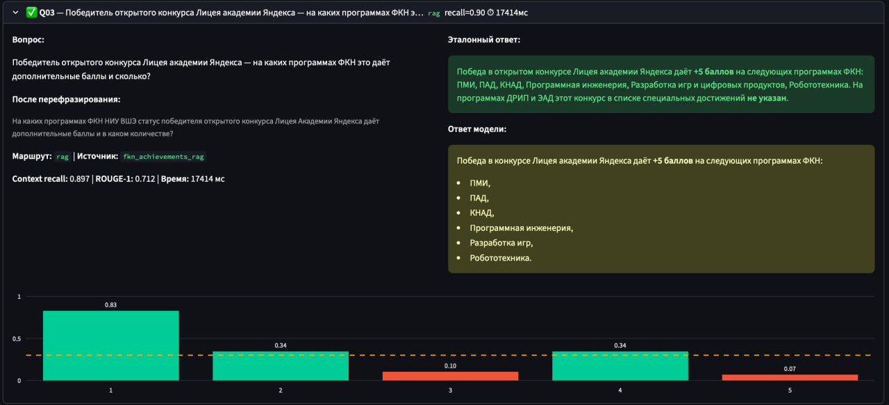

# 🎓 ФКН-бот — Телеграм-консультант по поступлению на ФКН НИУ ВШЭ


Телеграм-бот, который отвечает на вопросы абитуриентов **Факультета компьютерных наук НИУ ВШЭ**: баллы ЕГЭ, программы, квазибюджет, БВИ, скидки, олимпиады, сроки подачи документов и многое другое.

---

## Как это работает

Бот использует **гибридную архитектуру** из трёх слоёв:

```
Вопрос пользователя
        │       
┌───────────────┐     совпадение     ┌─────────────────┐
│  FAQ-кеш      │ ─────────────────> │  Мгновенный     │
│  (3 уровня)   │                    │  ответ          │
└───────────────┘                    └─────────────────┘
        │ нет
┌───────────────────────────────────────────────────────┐
│                   Agentic RAG                         │
│                                                       │
│  LLM декомпозиция -> поиск в ChromaDB -> reranking -> │
│  генерация ответа (YandexGPT)                         │
└───────────────────────────────────────────────────────┘
```

### FAQ-кеш (3 уровня)
1. **Точное совпадение** — нормализованный хеш вопроса, ответ мгновенно
2. **Динамический кеш** — ответы, которые пользователи подтвердили лайком (👍 RAG -> кеш)
3. **Fuzzy (Jaccard)** — нечёткое совпадение по токенам, порог настраивается

### Agentic RAG
- LLM анализирует вопрос и формулирует **1–3 точных поисковых запроса** (Query Decomposition)
- Каждый запрос ищется в **ChromaDB** (векторный индекс, `multilingual-e5-base`)
- Результаты дедуплицируются и **переранжируются** cross-encoder'ом (`mmarco-mMiniLMv2`)
- Объединённый контекст передаётся в LLM для финального ответа

Ниже представлены основные сценарии взаимодействия с ботом: 




### 1. Ответ на вопрос по базе знаний (RAG)
Бот анализирует вопрос, находит релевантные документы и дает точный ответ. Пользователь может оценить качество ответа.

<p align="center">
  
  
  
</p>
---

<p align="center">
  
</p>

## Возможности
- Задавай вопросы как удобно — голосом или текстом
- Задавай вопросы где удобно - на сайте, в чате или в боте
- Задавай вопросы на языке, на котором удобно — английский или русский
- 🇷🇺 / 🇬🇧 Автоопределение языка (русский / английский для программы ПАД)
- 👍 / 👎 Оценка каждого ответа пользователем
- Лайк на вопрос => добавляется в словарь вида вопрос-ответ
- Дизлайк на кешированный ответ => убирается из кеша, отправляется на ручную проверку
- 📊 Два дашборда для мониторинга (подробнее ниже)


---

## Дашборды

### Live Dashboard — мониторинг в реальном времени

Показывает, как бот работает прямо сейчас: на что ответил, как переформулировал вопрос, что оценили пользователи.



**Что видно:**
- Лента последних запросов с раскрытием: вопрос → декомпозиция суб-запросов → ответ бота → оценка 👍/👎
- Ключевые метрики: всего запросов, cache hit %, рейтинг лайков, средняя latency
- График запросов по часам и распределение маршрутов (FAQ / RAG / Калькулятор)
- Latency по времени с разбивкой по маршрутам
- Список дизлайкнутых ответов для ручного анализа
- Таблица декомпозиций: как бот переформулировал сложные вопросы




Автообновление каждые 5–60 секунд (настраивается). Фильтры по маршруту и оценке.

---

### RAG Dashboard — оффлайн-оценка качества

Позволяет прогнать тестовый датасет и оценить качество поиска и генерации по метрикам.



**Метрики:**
- **Hit@1 / Hit@3 / Hit@5** — нашёлся ли нужный чанк в топе
- **MRR@5** — Mean Reciprocal Rank
- **Precision@3 / Precision@5** — доля релевантных чанков
- **Context Recall** — покрытие эталонного ответа найденным контекстом
- **ROUGE-1 / ROUGE-L** — качество генерации
- **Latency** — время ответа, p95, распределение






---

## Структура проекта

```
├─ bot/
│   ├── bot.py              # Telegram-хендлеры, основной процесс
│   ├── agentic_rag.py      # Agentic RAG: декомпозиция + retrieval + генерация
│   ├── rag_engine.py       # ChromaDB, embeddings, reranker, generate()
│   ├── faq_cache.py        # 3-уровневый FAQ-кеш
│   ├── calculator.py       # Калькулятор конкурсного балла
│   ├── knowledge_base.py   # Системный промпт
│   ├── bot_events.py       # Логгер событий для live dashboard
│   ├── config.py           # Все настройки из env
│   ├── live_dashboard.py   # Live Dashboard (Streamlit)
│   ├── dashboard.py        # RAG Eval Dashboard (Streamlit)
│   ├── eval_rag.py         # Скрипт оффлайн-оценки
│   └── rag_check.py        # Ручная проверка RAG по QA-файлу
├─ dataset/                # База знаний (.md файлы)
└─ test/                   # Тестовые QA-датасеты
```

---

## Стек

| Компонент | Технология |
|-----------|-----------|
| Бот | `python-telegram-bot` v21 |
| Векторный поиск | `ChromaDB` (persistent) |
| Эмбеддинги | `intfloat/multilingual-e5-base` |
| Reranker | `cross-encoder/mmarco-mMiniLMv2-L12-H384-v1` |
| LLM | YandexGPT |
| Дашборды | `Streamlit` + `Plotly` |

---

## Запуск

### 1. Зависимости

```bash
cd bot
python -m venv venv
source venv/bin/activate 
pip install -r requirements.txt
```

### 2. Переменные окружения

```bash
export TELEGRAM_TOKEN=your_token
export YANDEX_API_KEY=your_key
export YANDEX_FOLDER_ID=your_folder
export USE_YANDEX=true


# дополнительно 
export GROQ_API_KEY=your_key
```

### 3. Запуск

**Только бот:**
```bash
python bot.py
```

**Бот +  дашборд одновременно:**
```bash
python bot.py &
streamlit run live_dashboard.py &
```

### 4. Оффлайн-оценка RAG

```bash
python eval_rag.py                     # быстрый прогон без LLM
python eval_rag.py --with-llm          # с генерацией и ROUGE-метриками
streamlit run dashboard.py             # смотреть результаты
```

---

